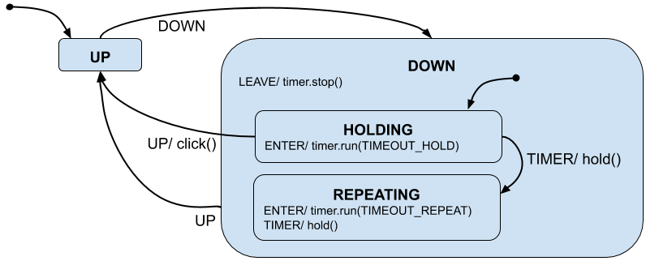

# TrimWright

This library lets you write memory- and CPU-efficient state machines in Arduino sketches.

It's based on ideas presented in [Practical UML Statecharts in C/C++](https://www.amazon.com/Practical-UML-Statecharts-C/dp/0750687061) by Miro Samek.
If you are interested in a professional quality implementation check out his [Quantum Platform in C++](https://www.state-machine.com/qpcpp/).

TrimWright supports many of the concepts in [UML state machines](https://en.wikipedia.org/wiki/UML_state_machine), with the following considerations:

* a "state" is an object method which is called for each event
* a "state machine" is an object with one-or-more of those methods
* TrimWright manages which method is the "current state" of the state machine
* "guard conditions" are just your code conditionally initiating state transitions
* state transtions are signaled by the return value of your state method, so handling of the current event will run-to-completion before the transition is processed
* entering and leaving states dispatch pseudo-events, allowing you to specify code for those parts of a state transition
* UML "orthogonal regions" are not supported by TrimWright
* UML "event deferal" is not supported by TrimWright

Besides the `FSM` and `HSM` base classes, this library also provides an event base
class, an event queue abstract base class, and a C++-templated ring buffer queue implementation.


## License
TrimWright is licensed under the MIT License.
See LICENSE.txt for details.


## Example -- Simple State Machine
In this example we create a `blinker` which has three states: off, slow, fast.
Our hardware has two buttons, up (pin 11) and down (pin 12), which change the state.


```cpp
#include <TrimWright.h>

enum {
    SIG_DOWN = TrimWright::SIG_USER,
    SIG_UP,
};

class Blinker : public TrimWright::FSM {
    private:
        uint16_t delayOn;
        uint16_t delayOff;
    public:
        void setup() {
            init((TrimWright::FSM::State) &Blinker::stateOFF);
        }
        void blink() {
            if (delayOn) {
                digitalWrite(13, HIGH);
                delay(delayOn);
                digitalWrite(13, LOW);
            }
            if (delayOff) {
                delay(delayOff);
            }
        }
        TrimWright::DispatchOutcome stateOFF(const TrimWright::Event* evt) {
            switch (evt->signal) {
                case TrimWright::SIG_ENTER:
                    delayOn = 0;
                    delayOff = 0;
                    return TW_HANDLED();
                case SIG_DOWN:
                    // wraps around to fast
                    return TW_TRANSITION(&Blinker::stateFAST);
                case SIG_UP:
                    return TW_TRANSITION(&Blinker::stateSLOW);
                default:
                    return TW_HANDLED();
            }
        }
        TrimWright::DispatchOutcome stateSLOW(const TrimWright::Event* evt) {
            switch (evt->signal) {
                case TrimWright::SIG_ENTER:
                    delayOn = 100;
                    delayOff = 400;
                    return TW_HANDLED();
                case SIG_DOWN:
                    return TW_TRANSITION(&Blinker::stateOFF);
                case SIG_UP:
                    return TW_TRANSITION(&Blinker::stateFAST);
                default:
                    return TW_HANDLED();
            }
        }
        TrimWright::DispatchOutcome stateFAST(const TrimWright::Event* evt) {
            switch (evt->signal) {
                case TrimWright::SIG_ENTER:
                    delayOn = 100;
                    delayOff = 100;
                    return TW_HANDLED();
                case SIG_DOWN:
                    return TW_TRANSITION(&Blinker::stateSLOW);
                case SIG_UP:
                    // wraps around to off
                    return TW_TRANSITION(&Blinker::stateOFF);
                default:
                    return TW_HANDLED();
            }
        }
} blinker;

void ISR_Button_Up() {
    static TrimWright::Event evt;
    evt.signal = SIG_UP;
    blinker.dispatch(&evt);
}

void ISR_Button_Down() {
    static TrimWright::Event evt;
    evt.signal = SIG_DOWN;
    blinker.dispatch(&evt);
}

void setup() {
    blinker.setup();
    pinMode(11, INPUT_PULLDOWN);
    pinMode(12, INPUT_PULLDOWN);
    pinMode(13, OUTPUT);
    attachInterrupt(11, ISR_Button_Up, RISING);
    attachInterrupt(12, ISR_Button_Down, RISING);
}

void loop() {
    blinker.blink();
}
```

Things to try:

* comment out the "wrap around" conditions and see how that affects what the buttons do
* add a new state, adjust the existing states so that you can transition to the new state
* add an event queue to the blinker, so that only one interrupt handler can write to it at a time


## Example -- Hierarchical State Machine
In this example a single button (pin 12) increases and decreases the rate which the LED blinks.
A click of the button causes the LED to blink faster, and holding the button down will cause the LED to blink slower.

This uses hierarchical states:  HOLDING and REPEATING are child states of DOWN.
Each state handles the `SIG_SUPER` event and responds with its parent.



This example is a little tricky since we need a timer to tell us that the user has held the button down a while.
We'll use a software timer, but some microcontrollers have a builtin hardware timer which can be used.
We'll also make this example a little trickier by using an event queue.
This allows our interrupt handler to simply push events onto the queue.
(It's considered good practice to do as little work as possible in interrupt handlers.)

```cpp
#include <TrimWright.h>

#define TIMEOUT_HOLD_MS (1000)
#define TIMEOUT_REPEAT_MS (200)

enum {
    SIG_TIMER = TrimWright::SIG_USER,
    SIG_BUTTON_DOWN,
    SIG_BUTTON_UP,
};

class Timer {
    private:
        uint32_t count;
        uint32_t compare;   // 0 means timer isn't running
    public:
        void setup() {
            count = 0;
            compare = 0;
        }
        void run(int16_t ms) {
            count = 0;
            compare = ms;
        }
        void stop() {
            compare = 0;
        }
        void tick();    // implemented below
} timer;

class LED {
    private:
        const uint8_t MAX_SPEED = 8;
        uint8_t speed;
        uint32_t count;
        uint32_t compareOn;
        uint32_t compareOff;
        void setCompares() {
            compareOn = 30 * speed;
            compareOff = compareOn + (20 * speed);
        }
    public:
        void setup() {
            pinMode(13, OUTPUT);
            digitalWrite(13, LOW);
            speed = 1;
            count = 0;
            setCompares();
        }
        void changeSpeed(bool faster) {
            if (faster) {
                speed = min(speed + 1, MAX_SPEED);
            } else {
                speed = max(speed - 1, 1);
            }
            setCompares();
        }
        void tick() {
            count++;
            if (count >= compareOff) {
                digitalWrite(13, LOW);
                count = 0;
                return;
            }
            if (count >= compareOn) {
                digitalWrite(13, HIGH);
                return;
            }
        }
} led;

class Button : public TrimWright::HSM {
    public:
        TrimWright::QueueRingBuffer<TrimWright::Event, 6> queue;
        void setup();   // implemented below
        void tick() {
            this->dispatchAll(&queue, false);
        }
        void click() {
            led.changeSpeed(true);
        }
        void hold() {
            led.changeSpeed(false);
        }
        TrimWright::DispatchOutcome stateUP(const TrimWright::Event* evt) {
            switch (evt->signal) {
                case SIG_BUTTON_DOWN:
                    return TW_TRANSITION(&Button::stateDOWN);
                default:
                    return TW_SUPER(&Button::stateROOT);
            }
        }
        TrimWright::DispatchOutcome stateDOWN(const TrimWright::Event* evt) {
            switch (evt->signal) {
                case TrimWright::SIG_INIT:
                    return TW_TRANSITION(&Button::stateHOLDING);
                case TrimWright::SIG_LEAVE:
                    timer.stop();
                    return TW_HANDLED();
                case SIG_BUTTON_UP:
                    return TW_TRANSITION(&Button::stateUP);
                default:
                    return TW_SUPER(&Button::stateROOT);
            }
        }
        TrimWright::DispatchOutcome stateHOLDING(const TrimWright::Event* evt) {
            switch (evt->signal) {
                case TrimWright::SIG_ENTER:
                    timer.run(TIMEOUT_HOLD_MS);
                    return TW_HANDLED();
                case SIG_TIMER:
                    hold();
                    return TW_TRANSITION(&Button::stateREPEATING);
                case SIG_BUTTON_UP:
                    click();
                    return TW_TRANSITION(&Button::stateUP);
                default:
                    return TW_SUPER(&Button::stateDOWN);
            }
        }
        TrimWright::DispatchOutcome stateREPEATING(const TrimWright::Event* evt) {
            switch (evt->signal) {
                case TrimWright::SIG_ENTER:
                    timer.run(TIMEOUT_REPEAT_MS);
                    return TW_HANDLED();
                case SIG_TIMER:
                    hold();
                    return TW_HANDLED();
                default:
                    return TW_SUPER(&Button::stateDOWN);
            }
        }
} button;

void Timer::tick() {
    if (!compare) {
        // timer isn't running
        return;
    }
    count++;
    if (count == compare) {
        TrimWright::Event evt;
        evt.signal = SIG_TIMER;
        button.queue.push_back(&evt);
        count = 0;
    }
}

void ISR_Button_Change() {
    TrimWright::Event evt;
    if (digitalRead(12) == LOW) {
        evt.signal = SIG_BUTTON_DOWN;
    } else {
        evt.signal = SIG_BUTTON_UP;
    }
    button.queue.push_back(&evt);
}

void Button::setup() {
    pinMode(12, INPUT_PULLDOWN);
    bool down = digitalRead(12) == LOW;
    if (down) {
        init((TrimWright::HSM::State) &Button::stateDOWN);
    } else {
        init((TrimWright::HSM::State) &Button::stateUP);
    }
    attachInterrupt(12, ISR_Button_Change, CHANGE);
}

void setup() {
    led.setup();
    timer.setup();
    button.setup();
}

void loop() {
    // we'll run the loop once every millisecond (roughly)
    // (A more sophisticated approach would be to put the CPU to sleep, but
    // first setup a hardware timer to wake the CPU every millisecond.)
    delay(1);
    led.tick();
    timer.tick();
    button.tick();
}
```


## API Reference
Add `#include <TrimWright.h>` to your sketch to use this library.
If you'd like to avoid writing the `TrimWright::` prefix you can add `using namespace TrimWright;` to your sketch.


### struct TrimWright::Event
```cpp
struct Event {
    uint8_t signal; // the type of each event instance
};
```

Since the states in a state machine respond to events, TrimWright includes an `Event` base class.

There are serveral event types which are used during state handling.
The following signals (event types) have special meaning:

* `SIG_ENTER`
    * dispatched when a state is entered
* `SIG_LEAVE`
    * dispatched when a state is about to be left
* `SIG_INIT`
    * dispatched on a `HSM` composite (parent) state so that it can transition to one of its child states
* `SIG_SUPER`
    * dispatched on a `HSM` state so that it can respond with its parent state
    * top-level states should respond with `stateROOT`
* `SIG_IDLE`
    * optional event type which can be used to signal that an event queue is empty

All signals less than `SIG_USER` are reserved by TrimWright.


### class TrimWright::FSM
```cpp
class FSM {
    public:
        typedef DispatchOutcome (FSM::* State)(const Event* event);
        void init(State initial);
        void dispatch(const Event* event);
        void dispatchIdle();
        void dispatchAll(IQueue* queue, bool idleIfEmpty);
};
```

This is the base class for non-hierarchical state machines.

Each state is a member function with the `State` signature mentioned above.
The state will be called for all event types (`event->signal`).
It should perform appropriate actions for the event and use one of the following macros for the return value:

* `return TW_HANDLED();`
    * the event was handled by this state
* `return TW_UNHANDLED();`
    * the event was not handled by this state
* `return TW_TRANSITION(&state);`
    * the state machine should transition to the new state


#### typedef TrimWright::FSM::State
```cpp
typedef DispatchOutcome (TrimWright::FSM::* State)(const Event* event);
```

Each state is a member function with the above signature.
The meaning of `DispatchOutcome` is best ignored by using one of the `TW_` macros mentioned above.


#### method init()
This should be called to setup the initial state of the state machine.
It can be called from a constructor.


#### method dispatch()
This method dispatches an event to the current state.
It will perform a transition if the state indicates that is necessary.
During transitions it'll dispatch the `SIG_LEAVE` and `SIG_ENTER` pseudo-events as needed.


#### method TrimWright::dispatchIdle
```cpp
void dispatchIdle();
```

This optional utility method dispatches a `SIG_IDLE` event type to the state machine.


#### method TrimWright::dispatchAll
```cpp
void dispatchAll(IQueue* queue, bool idleIfEmpty);
```

This optional utility method dispatches all events in the queue to the state machine.
If the queue is empty and `idleIfEmpty` is `true`, then a `SIG_IDLE` event type is dispatched.


#### example
```cpp
enum {
    SIG_EVENT_A = TrimWright::SIG_USER,
    SIG_EVENT_B,
};

class Machine : public TrimWright::FSM {
    Machine() {
        init((TrimWright::FSM::State) &Machine::stateON);
    }
    TrimWright::DispatchOutcome stateON(const TrimWright::Event *event) {
        switch(event->signal) {
            case SIG_EVENT_A:
                //...
                return TW_TRANSITION(&Machine::stateOFF);
            default:
                return TW_UNHANDLED();
        }
    }
    TrimWright::DispatchOutcome stateOFF(const TrimWright::Event *event) {
        switch(event->signal) {
            case TrimWright::SIG_ENTER:
                //...
                return TW_HANDLED();
            case SIG_EVENT_B:
                //...
                return TW_TRANSITION(&Machine::stateON);
            default:
                return TW_UNHANDLED();
        }
    }
};

Machine machine;

void loop() {
    TrimWright::Event evt;
    evt.signal = SIG_EVENT_A;
    machine.dispatch(&evt);
}
```


### class TrimWright::HSM
```cpp
class HSM {
    public:
        typedef DispatchOutcome (HSM::* State)(const Event* event);
        void init(State initial);
        void dispatch(const Event* event);
        void dispatchIdle();
        void dispatchAll(IQueue* queue, bool idleIfEmpty);
};
```

This is the base class for hierarchical state machines.

As for `FSM`, each state is a member function with the `State` signature mentioned above.
The state will be called for all event types (`event->signal`).
It should perform appropriate actions for the event and use one of the following macros for the return value:

* `return TW_HANDLED();`
    * the event was handled by this state
* `return TW_UNHANDLED();`
    * the event was not handled by this state
* `return TW_TRANSITION(&state);`
    * the state machine should transition to the new state
    * this should be used by composite (parent) states in response to the `SIG_INIT` event type to indicate which child state to enter
* `return TW_SUPER(&state);`
    * this should be used by child states in response to the `SIG_SUPER` event type to indicate the parent state
    * in practice this is a good return for any event type which the state doesn't know how to handle

TrimWright supports hierarchical state machines that are up to 6 levels deep.
Deeper state machines can be supported by defining the `TRIMWRIGHT_MAX_STATE_DEPTH` macro.
Defining it to a higher number than 6 will cause more call stack to be used during `init()` and `dispatch()`.


#### typedef TrimWright::HSM::State
```cpp
typedef DispatchOutcome (TrimWright::HSM::* State)(const Event* event);
```

Each state is a member function with the above signature.
The meaning of `DispatchOutcome` is best ignored by using one of the `TW_` macros mentioned above.


#### method init()
This should be called to setup the initial state of the state machine.
It can be called from a constructor.
It'll dispatch the `SIG_INIT` and `SIG_ENTER` pseudo-events as needed.


#### method dispatch()
This method dispatches an event to the current state.
It will perform a transition if the state indicates that is necessary.
During transitions it'll dispatch the `SIG_LEAVE`, `SIG_ENTER`, `SIG_SUPER`, and `SIG_INIT` pseudo-events as needed.


#### method TrimWright::dispatchIdle
```cpp
void dispatchIdle();
```

This optional utility method dispatches a `SIG_IDLE` event type to the state machine.


#### method TrimWright::dispatchAll
```cpp
void dispatchAll(IQueue* queue, bool idleIfEmpty);
```

This optional utility method dispatches all events in the queue to the state machine.
If the queue is empty and `idleIfEmpty` is `true`, then a `SIG_IDLE` event type is dispatched.


### abstract class TrimWright::IQueue
```cpp
class IQueue {
    public:
        // adds the event to the end of the queue
        virtual void push_back(Event*) = 0;

        // returns the event at the front of the queue
        virtual Event* front() = 0;

        // removes the event at the front of the queue
        virtual void pop_front() = 0;

        // returns the number of events in the queue
        virtual uint8_t size() = 0;

        virtual ~IQueue() {}
};
```

This optional abstract base class ("interface") defines minimum behaviour for a first-in/first-out event queue.
Another good choice is the [Queue class defined in FreeRTOS](https://www.freertos.org/Embedded-RTOS-Queues.html).


### template class TrimWright::QueueRingBuffer
```cpp
template <class EventType, uint8_t MAX_EVENTS>
class QueueRingBuffer : public IQueue {
    public:
        QueueRingBufer();
        void push_back(EventType*);
        EventType* front();
        void pop_front();
        uint8_t size();
};
```

This templated class provides a fixed-sized implementation of `IQueue`.
The `push_back()` method copies events into the queue.
Care should be taken so that no more than `MAX_EVENTS` are in the queue.


## Advanced Considerations


### Renaming the `init()` Method
When TrimWright classes FSM or HSM are used with multiple inheritance the `init()` method
could be confused with the same method from other ancestor classes.
The `TW_METHOD_INIT` preprocessing macro can be defined, effectively renaming the `init()` method.

In the Arduino IDE you can define custom macros in the `platform.local.txt` file.
It needs to reside beside the `platform.txt` file for the board which you are using,
which is usually `{arduino-install-dir}/packages/{vendor}/hardware/{architecture}/{version}/platform.local.txt`.
(`{vendor}` is the board vendor, e.g. `arduino` or `adafruit` or `SparkFun`.
`{architecture}` is the MCU architecture, e.g. `avr` or `samd`.
`{version}` is the version of the architecture, you'll usually only have one installed.)

example `platform.local.txt` file:
```cpp
compiler.cpp.extra_flags="-DTW_METHOD_INIT=initStateMachine"
```

When using platformio you can use the `build_flags` (in `[env]` sections) to define the macro.

example `platformio.ini` file:
```ini
[env:myboard]
build_flags = -D TW_METHOD_INIT=initStateMachine
```


